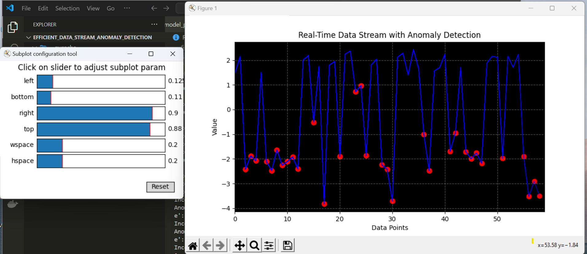
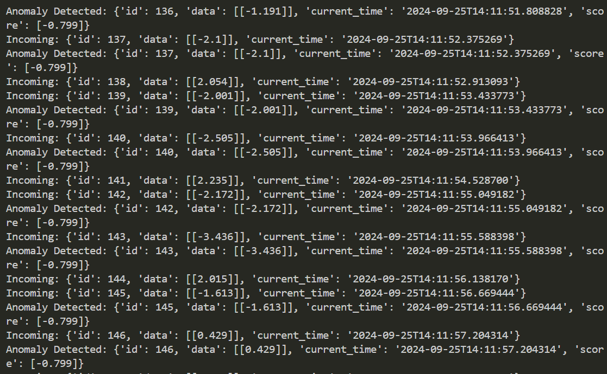

# Efficient Data Stream Anomaly Detection

## Project Description:


# Anomaly Detection Project

## Introduction

This project implements a Python script that is capable of detecting anomalies in a continuous data stream. This stream, simulating real-time sequences of floating-point numbers, could represent various metrics such as financial transactions or system metrics. Focus is on identifying unusual patterns, such as exceptionally high values or deviations from the norm.





## Algorithm Selection

### Why Isolation Forest?

Isolation Forest is an ensemble-based anomaly detection algorithm that works by isolating observations. The key reasons for selecting Isolation Forest are:

- **Robustness**: It effectively identifies anomalies in datasets where the data distribution is not Gaussian, making it suitable for complex and high-dimensional data.
- **Efficiency**: The algorithm operates efficiently on large datasets due to its low time complexity, making it ideal for real-time applications.
- **Minimal Assumptions**: Unlike other algorithms, it does not assume a specific data distribution, allowing it to capture a broader range of anomalies.

## Project Structure

The project is organized into several modules for clarity and maintainability:

1. **model_prod.py**: Contains the code to train the Isolation Forest model and save it for future use.
2. **anomaly.py**: Implements real-time anomaly detection, including data generation and visualization of results.
3. **settings.py**: Holds configuration settings, such as visualization options and data generation parameters.
4. **main.py**: The entry point that orchestrates model training and anomaly detection.


## Libraries Used

The project utilizes a few essential libraries to facilitate its functionality:

- **numpy**: For numerical operations and data manipulation.
- **scikit_learn**: Provides the Isolation Forest implementation and other machine learning tools.
- **joblib**: Used for saving and loading the trained model efficiently.
- **matplotlib**: For creating real-time visualizations of the data stream and detected anomalies.

A `requirements.txt` file is provided to facilitate the installation of these dependencies:

```plaintext
numpy==1.21.5
scikit_learn==1.0.2
joblib==1.2.0
matplotlib==3.4.3
```
## Error Handling and Data Validation

Robust error handling mechanisms are implemented throughout the codebase to ensure smooth operation and prevent crashes:

- **Model Loading**: If the model file is not found, a warning is logged, and the program exits gracefully.
- **Data Validation**: Incoming data points are validated before processing to ensure they conform to expected formats and ranges.
- **General Exception Handling**: Any unexpected errors are caught and logged, maintaining the system's stability and providing insights into potential issues.

### Example Error Handling

Here’s how errors are managed in the `anomaly.py`:

```python
try:
    model_path = os.path.abspath("isolation_forest.joblib")
    clf = load(model_path)
except FileNotFoundError:
    logging.warning("Model file not found")
    print("Model file not available. Exiting.")
    break
```
## Visualization

Real-time visualization is implemented using Matplotlib, allowing users to monitor incoming data points and detected anomalies. The visualization includes:

- **Dynamic Plotting**: The data points are plotted in real-time, with anomalies highlighted for easy identification.
- **Clear Markers**: Detected anomalies are represented as distinct markers on the plot.
- **Enhanced Readability**: The plot includes labels, a grid, and a title for better user experience.

## Conclusion

This anomaly detection project leverages the Isolation Forest algorithm for its robustness and efficiency. With a focus on modularity, comprehensive error handling, and effective visualization, the project is designed to be scalable and adaptable for real-world applications.


